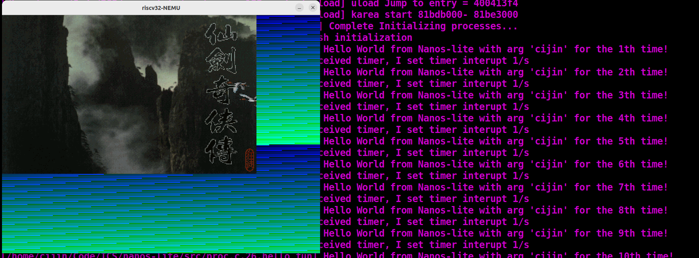
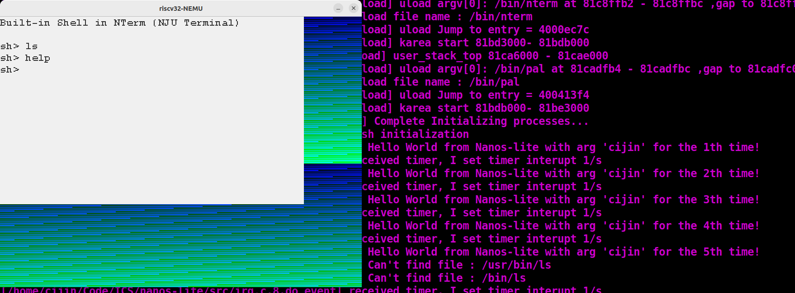

# ICS2021 Programming Assignment

This project is the programming assignment of the class ICS(Introduction to Computer System)
in Department of Computer Science and Technology, Nanjing University.

For the guide of this programming assignment,
refer to http://nju-ics.gitbooks.io/ics2021-programming-assignment/content/

To initialize, run
```bash
bash init.sh subproject-name
```
See `init.sh` for more details.

The following subprojects/components are included. Some of them are not fully implemented.
* [NEMU](https://github.com/NJU-ProjectN/nemu)
* [Abstract-Machine](https://github.com/NJU-ProjectN/abstract-machine)
* [Nanos-lite](https://github.com/NJU-ProjectN/nanos-lite)
* [Navy-apps](https://github.com/NJU-ProjectN/navy-apps)

# How to use

## Prepare
clone this repo
```
git clone git@git.nju.edu.cn:Ci_Jin/ICS.git .
```

install libaray
```
apt-get install build-essential    # build-essential packages, include binary utilities, gcc, make, and so on
apt-get install man                # on-line reference manual
apt-get install gcc-doc            # on-line reference manual for gcc
apt-get install gdb                # GNU debugger
apt-get install git                # revision control system
apt-get install libreadline-dev    # a library used later
apt-get install libsdl2-dev        # a library used later
apt-get install llvm llvm-dev      # llvm project, which contains libraries used later
apt-get install bison
apt-get install flex
apt-get install riscv64-linux-gnu-g++
apt-get install g++-riscv64-linux-gnu binutils-riscv64-linux-gnu
```

set global variable: add into your `~/.zshrc` or `~/.bashrc`
```
export NEMU_HOME='/home/cijin/Code/ICS/nemu'
export AM_HOME='/home/cijin/Code/ICS/abstract-machine'
export NAVY_HOME='/home/cijin/Code/ICS/navy-apps'
export ISA='riscv32'
```


## Init NEMU
```
cd nemu
make menuconfig
```
when making the config, enter `Testing and Debugging`. Disable the tracer for performance(Or it will run SUPER slow). Enable the `Device`. Enter the device and disable the audio.

Save the config

## Download PAL data file
You can download PAL data file at [Link](https://ci-jin.top/Resource/pal-data-new.tar.bz2)

make data dir:
```
cd navy-apps/apps/pal/repo
mkdir data
```
Then upzip datafile to `navy-apps/apps/pal/repo/data/`

After this, your files are supposed to be like:
```
.../ICS/navy-apps/apps/pal/repo
├── AUTHORS -> docs/AUTHORS
├── build
│   └── device
├── data
│   ├── 1.rpg
│   ├── 2.rpg
│   ├── 3.rpg
│   ├── 4.rpg
│   ├── 5.rpg
│   ├── abc.mkf
│   ├── ball.mkf
│   ├── data.mkf
│   ├── desc.dat
│   ├── fbp.mkf
│   ├── fire.mkf
│   ├── f.mkf
│   ├── gop.mkf
│   ├── map.mkf
│   ├── mgo.mkf
│   ├── m.msg
│   ├── mus.mkf
│   ├── pat.mkf
│   ├── rgm.mkf
│   ├── rng.mkf
│   ├── sdlpal.cfg
│   ├── sss.mkf
│   ├── voc.mkf
│   ├── wor16.asc
│   ├── wor16.fon
│   └── word.dat
├── docs
...
```


## Init Navy-app
```
cd navy-apps
make ISA=$ISA ramdisk
```

## Init Nanos-lite
```
cd nanos-lite
make ARCH=$ISA-nemu update
```

## Run the PAL and Nterm NOW!!!!
```
cd nanos-lite
make ARCH=$ISA-nemu run
```
After the loading animation, you can see the game running while stdout outputing Hello


You can press `F2` to change to Nterm, which is running synchronous with PAL

You can also press `F1` to swich back.

This synchronous running is based on The Time-Sharing Operating System
